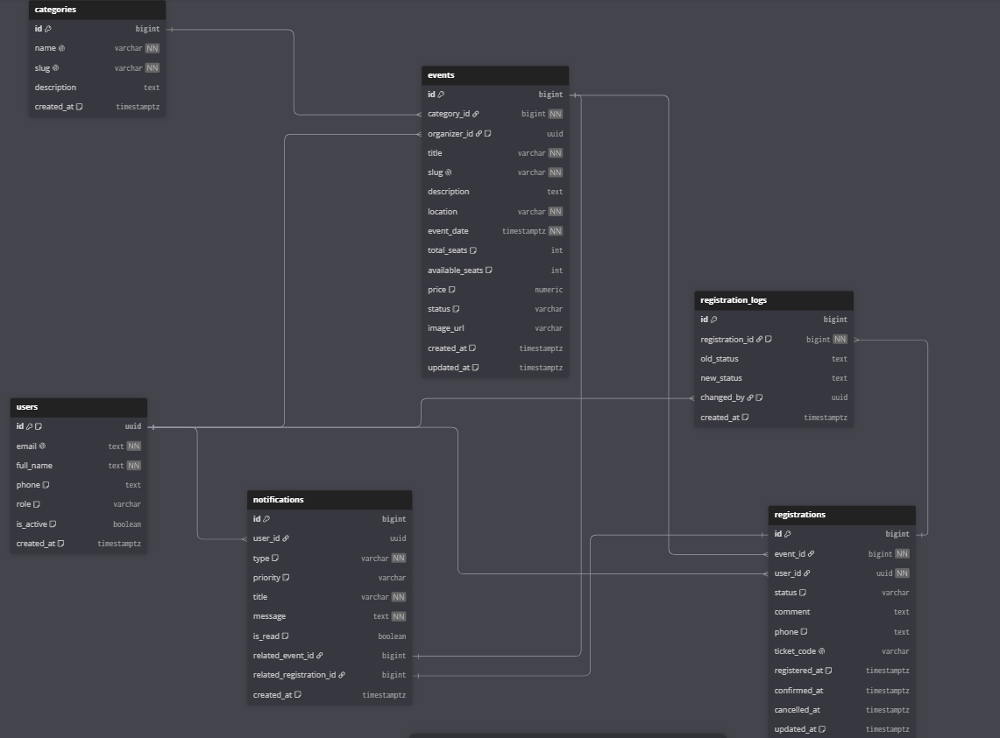

# Event HUB

Веб-приложение для централизованного управления регистрацией участников на мероприятия. Система предназначена для организаторов событий и потенциальных участников: она заменяет ручной учёт заявок по почте и формирует актуальный список зарегистрировавшихся с фиксацией статусов и контролем посещаемости.

**Опубликованное приложение:** https://mini-pet-m.onrender.com
**Figma-прототип:** https://www.figma.com/design/UHDLX4cMQcIH3XvcANU9iB/

---

## Роли

| Роль | Возможности |
|---|---|
| **Пользователь** | Каталог, регистрация на события, личный кабинет (регистрации + профиль), отмена своих заявок |
| **Организатор / Администратор** | Всё выше + аналитика, реестр заявок, смена статусов, экспорт CSV |
| **Супер Администратор** | Всё выше + управление пользователями (роли, блокировка) |

Начальная учётная запись администратора создаётся автоматически при первом запуске из переменных окружения `ADMIN_EMAIL` / `ADMIN_PASSWORD` (модуль `services/admin_init.py`). Публичная регистрация всегда создаёт пользователя с ролью `user` — назначить администратора через форму нельзя.

## Основные функции

Для участника:
- Каталог мероприятий с поиском (название, описание, место) и фильтрами по дате (сегодня / 7 дней / месяц) и категории — фильтрация мгновенная, без перезагрузки страницы;
- Прошедшие мероприятия помечаются как «Прошедшие» и доступны только для просмотра;
- Регистрация на событие с ФИО, email, телефоном и комментарием;
- Личный кабинет с вкладками «Мои регистрации» (история, статусы, отмена, таймер до ближайшего события) и «Профиль» (редактирование ФИО и телефона).

Для организатора:
- Панель аналитики: всего регистраций, активные события, общие сборы, процент отказов + диаграмма распределения по статусам;
- Реестр регистраций с фильтрами по статусу и участнику;
- Управление статусами (подтверждение, отмена, отметка посещения) с записью в журнал истории;
- Экспорт реестра в CSV (корректная кириллица в Excel за счёт BOM);
- Просмотр истории изменений статуса по заявке.

Для супер-администратора:
- Управление пользователями: роли (user / organizer / admin / super_admin), блокировка (`is_active`), редактирование профилей.

## Новые функции текущей версии

1. **История изменения статусов** — журнал `registration_logs`, tooltip с историей в реестре;
2. **Экспорт CSV** с учётом активного фильтра;
3. **Поиск и многофакторная фильтрация** каталога (по названию/описанию/месту + дата + категория);
4. **Жизненный цикл статусов**: создана → подтверждена → посещено / отменена, с запретом недопустимых переходов на сервере;
5. **Пометка и блокировка прошедших мероприятий**;
6. **Автоматическое создание администратора из `.env`** при первом запуске;
7. **Редактирование профиля** в личном кабинете.

## Бизнес-правила (проверяются на сервере, а не только в интерфейсе)

- запрет повторной регистрации пользователя на одно событие;
- запрет регистрации при отсутствии свободных мест (место возвращается при отмене);
- запрет регистрации на завершившееся мероприятие;
- отмена заявки возможна только из статусов «Создана» / «Подтверждена»;
- административные операции недоступны без соответствующей роли — проверка выполняется на сервере в декораторах `services/security.py`;
- нельзя изменить собственную роль или заблокировать себя;
- заблокированный пользователь не может войти (проверка `is_active` при логине).

## Технологический стек

- **Backend:** Python 3, Flask (Blueprints), gunicorn
- **База данных:** PostgreSQL в Supabase (таблицы, представления, Row Level Security)
- **Аутентификация:** Supabase Auth (email + пароль)
- **Frontend:** HTML + Jinja2, CSS, vanilla JavaScript
- **Тестирование:** pytest (автотесты бизнес-правил с изолированным фейком БД)
- **Деплой:** Render (автодеплой из GitHub)

## Архитектура и безопасность

```
Браузер ──HTTP──► Flask (Render)
                    │
                    ├── routes/       auth · main · admin  (сессия, роли)
                    ├── services/     supabase_client, security, log_service,
                    │                 formatters, admin_init
                    └── Supabase
                         ├── Auth      (anon key — только вход/регистрация)
                         └── PostgreSQL (service_role — все данные)
```

- Ключ `service_role` хранится только в серверном `.env` и не передаётся в браузер;
- анонимный ключ используется исключительно для операций Supabase Auth;
- для всех таблиц включён Row Level Security, у ролей `anon`/`authenticated` отозваны гранты — прямой доступ извне закрыт;
- пароли пользователей хранятся только в Supabase Auth (bcrypt), в собственных таблицах паролей нет;
- детали исключений в интерфейс не выводятся, секреты не попадают в логи;
- HTML/Jinja-шаблоны экранируют вывод (защита от XSS).

## База данных

### ER-диаграмма



### Таблицы и связи

| Таблица | Назначение | Ключевые поля |
|---|---|---|
| `users` | Профили пользователей и роли | PK `id` (uuid, FK → `auth.users`), `role`, `is_active` |
| `categories` | Справочник категорий мероприятий | PK `id`, UNIQUE `slug` |
| `events` | Мероприятия | PK `id`, FK `category_id` → `categories`, `event_date`, `total_seats`, `available_seats`, `price` |
| `registrations` | Заявки на участие (жизненный цикл статусов) | PK `id`, FK `user_id` → `users`, FK `event_id` → `events` |
| `registration_logs` | История изменения статусов заявок | PK `id`, FK `registration_id` → `registrations`, `old_status`, `new_status`, `changed_by` |
| `notifications` | Уведомления пользователей | PK `id`, FK `user_id` → `users`, `is_read` |

Представления: `admin_registrations_view`, `event_details_view`, `v_admin_dashboard`, `v_event_stats`.

Связи (минимум две, включая «один ко многим»):
- `users 1─∞ registrations` — у пользователя много заявок;
- `events 1─∞ registrations` — на мероприятие много заявок;
- `categories 1─∞ events` — у категории много мероприятий;
- `registrations 1─∞ registration_logs` — у заявки много записей истории.

Начальные данные заполняются сидерами `db/seed.py` и `db/seed_users.py`.

## Матрица доступа

| Операция | Пользователь | Администратор | Супер Админ |
|---|---|---|---|
| Просмотр каталога и карточки события | ✅ | ✅ | ✅ |
| Регистрация на событие / отмена своей заявки | ✅ | ✅ | ✅ |
| Редактирование собственного профиля | ✅ | ✅ | ✅ |
| Просмотр чужих регистраций | ❌ | ✅ | ✅ |
| Смена статусов заявок, экспорт CSV | ❌ | ✅ | ✅ |
| Аналитика и диаграммы | ❌ | ✅ | ✅ |
| Управление пользователями | ❌ | ❌ | ✅ |
| Смена собственной роли / самоблокировка | ❌ | ❌ | ❌ |

## Структура проекта

```text
mini-pet-m/
├── db/                  # Сидеры тестовых данных (seed.py, seed_users.py)
│   └── check_queries.sql# Проверочные SQL-запросы (WHERE, ORDER BY, JOIN, COUNT, GROUP BY)
├── routes/              # Blueprints: auth, main, admin
├── services/            # supabase_client, security, log_service,
│                        # formatters, admin_init (админ из .env)
├── src/app.py           # Фабрика приложения (вызов ensure_admin)
├── static/              # styles.css, app.js
├── templates/           # base, index, detail, cabinet, admin,
│                        # admin_users, login, register
├── tests/               # pytest: автотесты бизнес-правил (фейк БД, без сети)
├── docs/                # ER-диаграмма и скриншоты
├── .env.example         # Шаблон переменных окружения (без секретов)
├── .gitignore           # .env, venv, __pycache__
└── requirements.txt
```

## Локальный запуск

```bash
git clone https://github.com/zonor121/mini-pet-m.git
cd mini-pet-m
python -m venv venv && source venv/bin/activate    # Windows: venv\Scripts\activate
pip install -r requirements.txt
cp .env.example .env                                # заполнить значения
python -m src.app                                   # http://127.0.0.1:5000
```

При первом запуске, если заданы `ADMIN_EMAIL`/`ADMIN_PASSWORD` и профиля с таким email нет, автоматически создаётся учётная запись супер-администратора.

## Переменные окружения

| Переменная | Назначение |
|---|---|
| `SUPABASE_URL` | URL проекта Supabase |
| `SUPABASE_KEY` | анонимный ключ (только Supabase Auth) |
| `SUPABASE_SERVICE_ROLE_KEY` | серверный ключ, доступ ко всем данным |
| `FLASK_SECRET_KEY` | секрет сессий Flask |
| `ADMIN_EMAIL` | email начальной учётной записи администратора |
| `ADMIN_PASSWORD` | её пароль (в коде и логах не хранится) |
| `ADMIN_NAME` | (опционально) отображаемое имя администратора |

Файл `.env` в репозиторий не коммитится (`.gitignore`), секретные значения в исходном коде отсутствуют.

## Тестирование

```bash
pip install pytest
python -m pytest tests/ -v
```

Автотесты (`tests/test_business.py`) покрывают бизнес-правила: повторную регистрацию, исчерпание мест, прошедшие события, отмену (свою/чужую/финальные статусы), валидацию и обновление профиля, доступ к кабинету без сессии. База данных не используется — `supabase_admin` подменяется in-memory фейком.

Проверочные SQL-запросы к базе — в `db/check_queries.sql` (выборка с WHERE, ORDER BY, JOIN трёх таблиц, агрегат COUNT, GROUP BY и запрос показателя «Общие сборы» административной панели).

## Деплой

Автодеплой из GitHub на Render: `gunicorn src.app:app`, переменные окружения задаются в настройках сервиса Render. Публичный адрес: https://mini-pet-m.onrender.com
